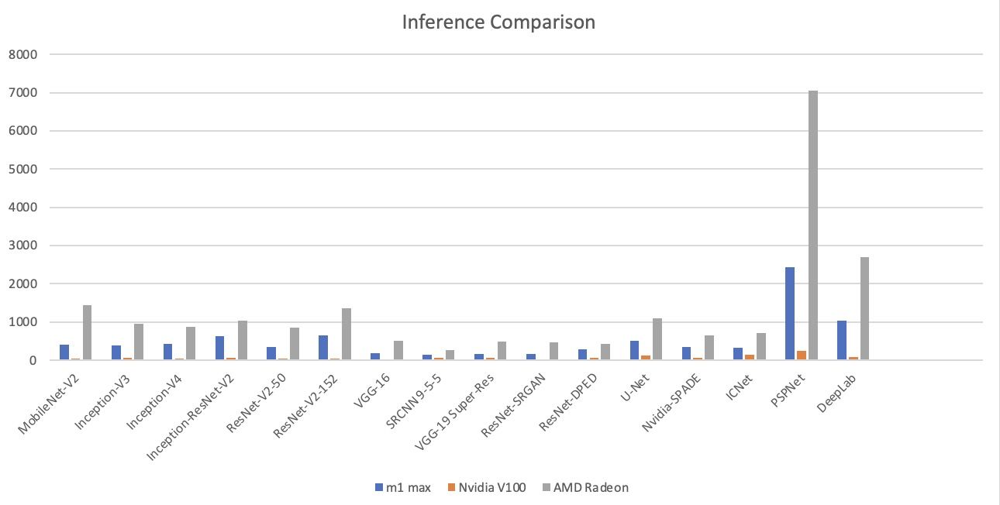
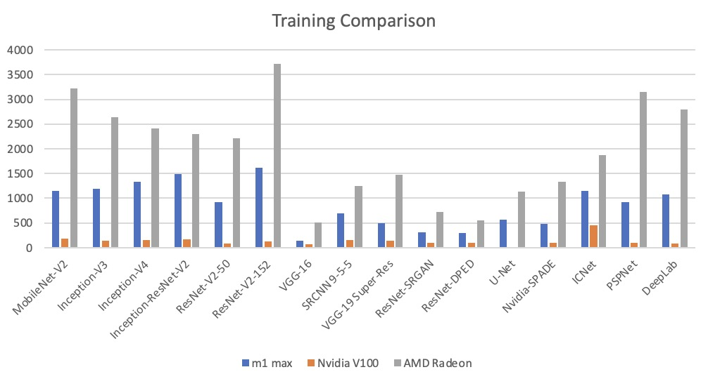
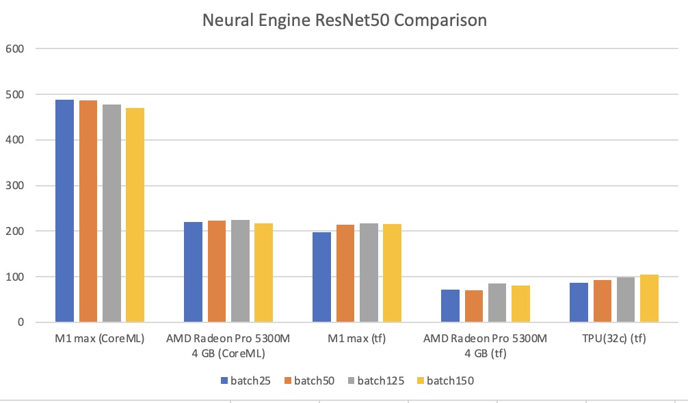

# S22_15618_Project
This is the final project for CMU 15618 course.

andrewid: 
xuelinz
shanyuew

# Proposal
## Summary
In this project, we are going to investigate the performance of Apple's newly produced ARM based architecture chip M1 max. Specifically, we are going to benchmark its CPU performance, GPU performance and neural engine performance with existing tools.

## Background
M1 max chip is Apple's newly produced chip based on ARM. The newly produced chip has become super popular due to its performance in the desktop's chip. Also, ARM architecture made a breakthrough in the nowadays' x86 dominated desktop chip market. It's interesting to test whether the chip can match its advertised performance, and more importantly, to investigate how the chip achieves the performance.

## Challenges
**Lack of background knowledge:**
We are going to investigate the performance of an ARM based chip which is different from the x86 chips that we have studied before. We also didn't touch the area of neural engine analysis before, it's a new thing for us.

**Lack of open source materials:**
Since the M1 Max chip's design is not open-sourced. It's expected to be difficult to gather enough supporting material for our analysis.

## Resources
**Hardwares:**

Local computer 2021 MacBook Pro (Apple M1 Max with 10-core CPU, 24-core GPU, 16-core Neural Engine), 2019 MacBook Pro with Intel chip (8-core Intel Core i7-9750H).

GHC NVIDIA GPU (NVIDIA GeForce RTX 2080 B GPU).

Google Cloud with V100 GPU.

**Softwares:**

CPU benchmark: [Geekbench5](https://www.geekbench.com)

GPU AI benchmark: [ai-benchmark](https://pypi.org/project/ai-benchmark/)

NPU benchmark: [tf-metal-experiments](https://github.com/tlkh/tf-metal-experiments)

## Goals and deliverables
### 75% goal
Comparing two chips’ CPU performance and explain the difference from the perspective of structure of the chips using the knowledge from class and desk research.
### 100% goal
Our 100% goal is to compare two chips' GPU, NPU abilities and possibly video encoding/decoding abilities and explain the differences from a heterogeneous chip design perspective.
### 125% goal
We consider writing our own SIMD benchmark as a 125% goal.

# Diliverables
Please find the report in the same directory. `final_report.pdf`

Video is uploaded to [youtube](https://www.youtube.com/watch?v=vkh0ZxbLSMw)

Here are some important benchmark figures.

# CPU

# GPU

# ANE
