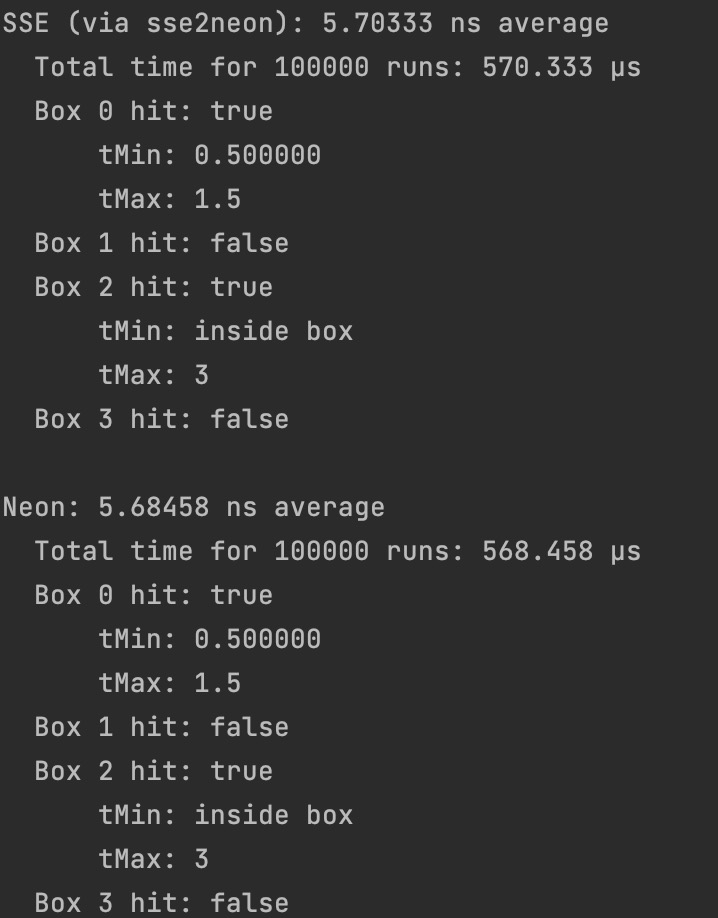

# S22_15618_Project
This is the final project for CMU 15618 course.

andrewid: 
xuelinz
shanyuew

# Proposal
## Summary
In this project, we are going to investigate the performance of the apple newly produced ARM based architecture chip M1 max. Specifically, we are going to divide the project into two perspective. Firstly, we are going to investigate the M1 max performance in SIMD applications. Secondly, we are also intereseted in the design and performance of neural engines on M1 max.

## Background
M1 max chip is apple's newly produced chip based on ARM. The newly produced chip has become super popular due to its performance in the desktop's chip. Also, ARM architecture made a breakthrough in the nowdays' x86 dominated desktop chip market. In this project, we are going to investigate the chip in details and understand two aspects, SIMD on ARMS and M1 max neural engine performance.

## Challenges
**Parallelism perspective:**
We are going to investigate the SIMD performance of ARM based chip and x86 chip. Studying from the instruction level, we are going to answer questions like: does this arm chip have  fixed-length vectors, support scatter-gather and support permutations?

**Computer architecture perspective:**
Besides, we are going to investigate the nearul engine performance. We are going to divise a way to accurately benchmarking the performances of M1 chips and x86 chips. Also, we intend to compare the performance with GPU. Derived from the benchmark results, we are going to understand the architecture reasons behind the hood, which leads to the performance boost or degradation.

## Resources
Local computer 2021 MacBook Pro (Apple M1 Max with 10-core CPU, 24-core GPU, 16-core Neural Engine), 2019 MacBook Pro with Intel chip (8-core Intel Core i7-9750H).

Ghc NVIDIA GPU (NVIDIA GeForce RTX 2080 B GPU).

## Goals and deliverables
### 75% goal
Write a benchmark program to compare the SIMD performance of an Intel chip and an M1 max chip. Analye features affecting the SIMD performance of a chip.
### 100% goal
Explore M1 max chip SIMD instruction set and compare its supported features against an Intel chip.
### 125% goal
Explore M1 max chip's nerual engine unit, benchmark its performance and explain what designs makes it possible to speedup deep learning tasks.

## Schedule
03/27/2022 Explore common benchmark problems and choose one.

04/02/2022 Implment the benchmark program on both platforms.

04/09/2022 Perform benchmark experiments and identify features affecting a CPU's SIMD performance.

04/16/2022 Analysis extra SIMD features supported by M1 max, such as catter-gather and permutations.

04/30/2022 Benchmark common AI jobs on M1 max, describe their computation patterns and explain why can nerual engine accelerate these computation patterns.

# Checkpoint (Apr 11 2022)
We have formulated different perspectives of this benchmarking explorations. Simply put, we decide to implement the benchmarking on different applications. Also, for the SIMD part, we have implemented the NEON SIMD benchmarking experiments. The experimentatal results are demonstrated in the following sections.

## NEON SIMD
SIMD stands for single instruction, multiple data, and is a type of parallel programming that exploits data level parallelism. Unlike multithreading, in which multiple different streams of instructions simultaneously execute on different cores over different pieces of data, in a SIMD program, a single instruction stream executes simultaneously over different pieces of data in lanes that are instructed by the program. For example, a 4-wide SIMD multiplication instruction would simultaneously execute a single multiply instruction over four pairs of numbers; each pair is multiplied together at the same time as the other pairs. SIMD processing makes processors more powerful by allowing the processor to process more data within the same clock cycle; many modern CPUs implement SIMD extensions to their base scalar instruction sets, and modern GPUs are at a very high level broadly similar to huge ultra-wide SIMD processors.

There are several ways to implement SIMD capabilities. Firstly, simply using assembly instructions, we could explicitly command the chip to execute the SIMD instructions as the program requires to. Secondly, write normal scalar codes and rely on compiler auto-vectorization to emit vectorized instructions. Lastly, writing third party managed library such as ISPC and NEON to instruct the compiler to generate SIMD instructions. 

What's more, NEON provides a simple way to transform original SSE2 SIMD instructions to NEON. Provided in [here](https://github.com/DLTcollab/sse2neon).

In our project, we use the NEON and ISPC to generate SIMD codes, and compare its performance difference between two different chip running environments.

For benchmarking reasons, we based the benchmarking project on the graphic application. Specifically, we did experiments on BVH (Bounding Volume Hierarchies).

Here are some results that we have retrieved.

